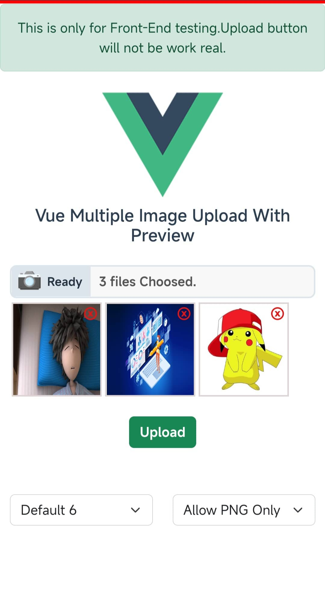

# Vue Component Multiple Image Upload

# Welcome

Hello Everyone,My name is **Zin Min Htet** and here is my [**Facebook account**](https://www.facebook.com/mm.zakerxa).

Now, I will show you how to Upload Multiple Image using Vue-Component.

There is an image Preview, Remove & Add More features.

You can also limit the maximun amount of upload, the Image size & format.


# Here is Live Demo



**Watch Now [Live Demo](https://vue-multi-image-upload.vercel.app).**


## Installation

```NPM
npm i @zakerxa/vue-multiple-image-upload
```

## Setup

**1 - Import the vue component locally in the script Tag**

```Vue
<script>
 import { VueMultiImageUpload } from '@zakerxa/vue-multiple-image-upload';

  export default {
    components:{
      VueMultiImageUpload
    }
  }
</script>
```
**OR**
**Global registration in your main.js**

```Javascript
 import { VueMultiImageUpload } from '@zakerxa/vue-multiple-image-upload';
 const app = createApp(App);
 app.component("vue-multi-image-upload", VueMultiImageUpload);

```

**2 - In your Vue Template**

```Vue
<template>
    <vue-multi-image-upload @data-image="images" :max="4" :data-reset="component"/>
</template>
```

`⇃⇃⇃⇃⇂⇂⇂⇂`

```Vue
<script>
export default {
    data(){
      return {
        component : {}
      },
    },
    methods:{
        images(e){
          e.map(res=>console.log(res))
        },
        clear(){
            this.component.clear = true;
        }
    }
}

</script>
```


## Explanation of usage

**1.Images methods can listen child input data from parent the component.**
```
  @data-image="images"
  images(e){
   e.map(res=>console.log(res))
  }
```

**2.We can limit the number of image to upload maximun**
```
:max="limitNumber"
```

**3.We can also limit the images size & format.**
```
:image-size="imageSize" :image-format="formatType"

this.imageSize = 2000000; // 2MB
ImageSize only allow 2MB else We will show alert msg to user.

this.formatType = ['image/jpeg', 'image/png', 'image/jpg'];
FormatType will allow the things you have given.
```

**4.And, There is one options.Options can change the message inputBox.**
```
:options="options"
this.options.max = "Max";
this.options.ready = "Ready";
this.options.select = "Choosed";
```

**5.If you want to reset child component data,You can use :data-reset props to passing Object**
```
:data-reset="components"
this.component.clear = true;
```


<table class="table">
  <thead>
    <tr>
      <th scope="col">Props</th>
      <th scope="col">Data Type</th>
      <th scope="col">Default</th>
      <th scope="col">Description</th>
    </tr>
  </thead>
  <tbody>
    <tr>
      <td scope="row">max</td>
      <td>Number</td>
      <td>8</td>
      <td>Upload File Limit</td>
    </tr>
    <tr>
      <td scope="row">imageSize</td>
      <td>Number</td>
      <td>4000000</td>
      <td>Image File Size</td>
    </tr>
    <tr>
      <td scope="row">imageFormat</td>
      <td>Array</td>
      <td>[image/png, image/jpg, image/jpeg]</td>
      <td>Image's Format Validate</td>
    </tr>
     <tr>
      <td scope="row">dataReset</td>
      <td>Object</td>
      <td>false</td>
      <td>Reset the child component data.</td>
    </tr>
     <tr>
      <td scope="row">Options</td>
      <td>Object</td>
      <td>"Maximun","Ready","Selected"</td>
      <td>Input Box Message.</td>
    </tr>
  </tbody>
</table>


## Usage

**That's all what you need**

```Vue
<template>
   <vue-multi-image-upload @data-image="images" :max="4" :data-reset="component" :options="options" :image-size="imageSize" :image-format="formatType"/>
   <button @click="component.clear = true">Clear</button>
</template>

<script>

import { VueMultiImageUpload } from '@zakerxa/vue-multiple-image-upload';

export default {
    data(){
        return {
          component : {},
          options : {},
          inputImages : '',
          imageSize : 2000000, // 2MB
          formatType : ['image/jpeg', 'image/png']
        }
    },
    components:{
      VueMultiImageUpload
    },
    methods:{
      images(e){
        this.inputImages = e;
        e.map(res=> console.log(res);); 
      },
      inputFormData(){
        // In this project I will not use this function
        // This is only for real production project
        // You can post by calling this.inputFormData() Function
        
        let formData = new FormData();
        // Append to the FormData.
        formData.append('name', "Zakerxa");
        formData.append('price', 1000);
        formData.append('details', "This is product Details");
        // The way to append images to FormData.
        this.inputImages.map(img => formData.append('images[]',img));
        return formData;
      }
    },
    mounted(){
      // Options
      this.options.max = "Max";
      this.options.ready = "Ready";
      this.options.select = "Choosed";
    }
}
</script>

```
